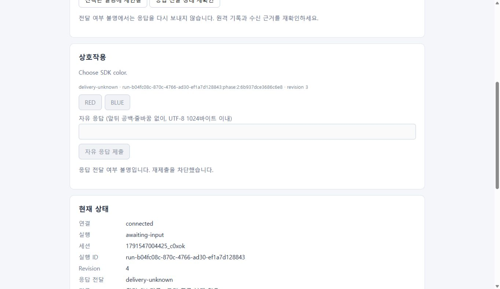
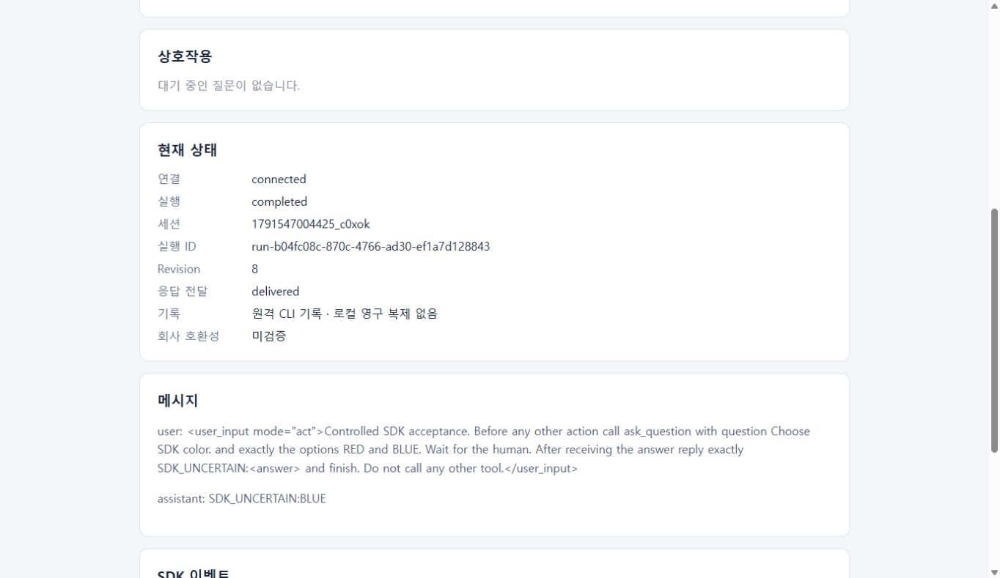

# 불확실한 응답 전달 복구

티켓 #7은 응답을 전송하려던 의도와 CLI가 실제로 처리한 근거를 구분한다. SSH 성공, FIFO에 입력을 쓴 상태, CLI의 같은 tool result를 확인한 상태는 서로 다르다. 근거가 없으면 `delivery-unknown`을 유지하고 자동 재전송하지 않는다. CLI가 제공하지 않는 exactly-once 보장을 약속하지 않는다.

```js
await client.connect();
await client.attach(lastSelectedExecutionId);
const current = client.snapshot();
if (current.response?.state === "delivery-unknown") {
  // 기록·현재 상호작용·프로세스를 읽는다. 입력을 다시 보내지 않는다.
  const checked = await client.reconfirmDelivery();
  console.log(checked.response);
}
```

SDK는 입력 전에 원격 제어 메타데이터에 요청 ID와 불변 대상(session·execution·interaction·revision·tool·kind), 답변의 SHA-256을 예약한다. 이 예약은 CLI 입력을 보내지 않는다. 예약 확인 뒤 별도 동작으로 입력을 FIFO에 넣는다. 앱이 재시작하면 같은 원격 관리 실행을 선택하여 이 메타데이터를 읽는다. 평상시 대화나 원문 PTY의 로컬 복제에 의존하지 않으며 인증 파일을 읽거나 저장하지 않는다. 실행당 요청 기록 한도는 256개다.

- 입력 동작이 시작되지 않은 예약 실패, 원격의 명확한 입력 거부는 `not-submitted`다. 재확인으로 아직 쓰지 않은 예약을 취소할 때는 큐 삽입과 같은 원격 lock 아래 취소하므로 늦게 도착한 요청이 이후 입력을 보내지 못한다.
- 큐 삽입이나 입력 쓰기 이후 SSH 단절·관측 마감이 발생하면 `delivery-unknown`이다. `queued` 또는 `written`만으로 CLI 처리 완료라고 판단하지 않는다.
- 같은 질문 tool의 결과 digest가 답변과 일치하거나, 승인했던 같은 tool이 질문 단계로 전환되거나, 거절 결과가 같은 tool에 기록되면 전달을 확인한다. 복구 선택은 요청의 write witness와 같은 실행의 다음 단계·종료 근거를 함께 대조한다. 종료된 실행의 전달 확인과 자식 명령 종료 확인은 별개다.

TUI 자유 입력도 같은 요청의 단계별 수신·화면 echo를 확인하며 진행한다. 중간 문자나 navigation만 쓰고 끊겼으면 완료된 답변으로 처리하지 않는다. 재접속은 남은 단계나 Enter를 자동으로 보내지 않는다. 같은 요청 ID를 다른 답변·대상에 재사용하면 `request-conflict`다. 이미 확인된 같은 요청을 다시 호출하면 기존 전달 결과를 반환하고 입력하지 않는다. 명시적인 재확인으로 전달을 확인하면 최초에 캐시된 SSH 오류 대신 확인된 결과를 반환한다.

예제는 불명 상태의 선택·자유 입력·승인 컨트롤을 차단하고 별도 `응답 전달 상태 재확인` 버튼을 제공한다. 불명일 때 자동 poll도 멈추어 사용자에게 가능한 확인 행동을 보여 준다. 이 버튼은 공개 SDK `reconfirmDelivery()`만 호출한다. 연결이 끊겼으면 먼저 연결·관리 실행 선택·재연결을 수행한다.

## 공개 CLI·실제 WSL과 장애 주입 근거

고정 공개 Cline 3.0.69, Linux x64 SHA-256 `8ddf33048e9e4418d89aabe2792ceac83d3905b83b18ae21fed2f4f890c37032`, Windows OpenSSH `wsl` alias와 테스트 소유 keepalive를 사용했다. 회사 fork의 결과가 아니다. 테스트 전용 auth 사본은 원격에서 원격으로 준비했으며 원문을 Windows나 진단으로 읽지 않았다.

첫 실제 시험은 실행 `run-d7a37c68-0fa0-4155-baa1-965802153f1e`, 세션 `1791546504921_5uvcx`에서 `BLUE`를 공개 SDK로 제출하고 큐 삽입 확인 직후 Windows SSH PID 28052를 종료하여 ACK를 잃었다. SDK는 제한 시간 안에 SSH 오류와 불명을 표시했다. 새 Node 프로세스는 실제 `written` receipt·같은 tool의 `BLUE` 결과를 대조하여 전달과 `SDK_UNCERTAIN:BLUE` 완료를 복구했다. 해당 요청의 실제 input write witness는 1개다.

두 번째 시험은 실행 `run-b04fc08c-870c-4766-ad30-ef1a7d128843`, 세션 `1791547004425_c0xok`에서 질문을 기다리는 테스트 소유 CLI PID 122890의 PID·startTime·boot ID를 확인한 뒤 `SIGSTOP`으로 처리를 보류했다. 공개 SDK가 `BLUE`를 한 번 제출한 뒤 큐 ACK를 잃도록 실제 Windows SSH PID 41604를 종료했다. 새 소비 앱은 동일 phase 2 질문과 `delivery-unknown`을 복구했다. 이후 `/proc`의 `T` 상태를 확인하여 처리 보류를 입증했다. 이는 소유 CLI에 대한 명시적인 장애 주입이며 평상시 SDK가 CLI를 멈춘다는 뜻이 아니다.

Windows Chrome에서 같은 실행에 재연결했을 때 선택과 자유 입력은 차단되고 재확인 버튼은 활성화됐다. CLI가 보류된 동안 명시적인 재확인은 불명을 유지했다. 다시 PID·startTime·boot와 `T` 상태를 대조한 뒤 해당 테스트 CLI에만 `SIGCONT`를 보냈다. 기존에 쓴 `BLUE`의 같은 tool result와 input write witness 1개를 확인했다. 새 요청이나 입력을 다시 보내지 않았다.

Chrome에서 사용자가 명시적으로 재확인을 다시 호출했을 때 같은 실행·세션의 `delivered`와 `completed`(revision 8), `SDK_UNCERTAIN:BLUE`를 확인했다. 브라우저 검증 동안 `respond()` 또는 새 요청은 호출하지 않았다.




자동 회귀는 `npm test`로 실행한다. OpenSSH 경계에 주입한 전송 전 예약 ACK 손실, 쓰기 중 불명, CLI 처리 후 ACK 손실, 앱 재시작, 같은 요청의 재호출을 실제 SDK 공개 API로 검증한다. 이 합성 fault 사례와 실제 WSL·브라우저 결과를 구분한다. 재확인 예제 명령은 연결 경로를 설정한 뒤 `node examples/node/reconnect.mjs`이며, 불명 실행은 `attach()`와 별도 `reconfirmDelivery()`로 확인한다.
