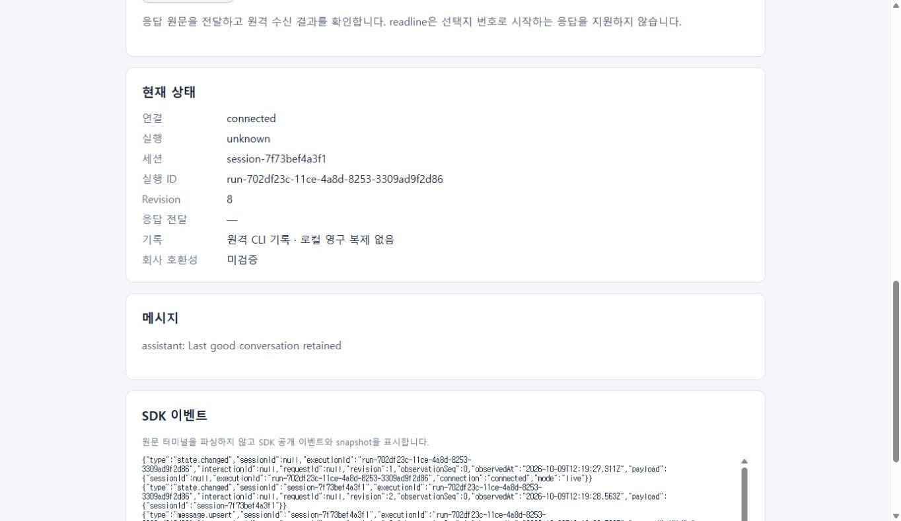
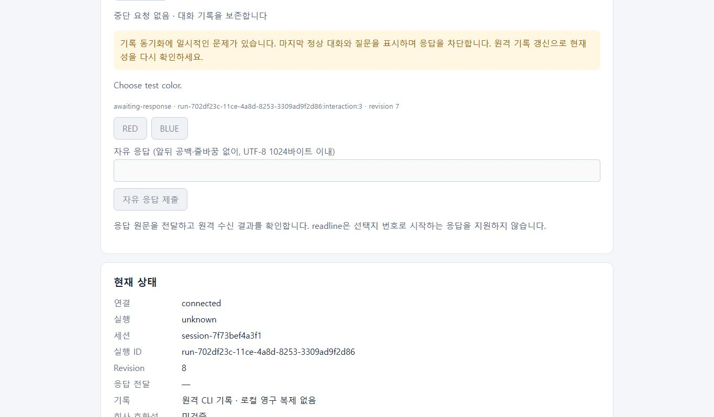
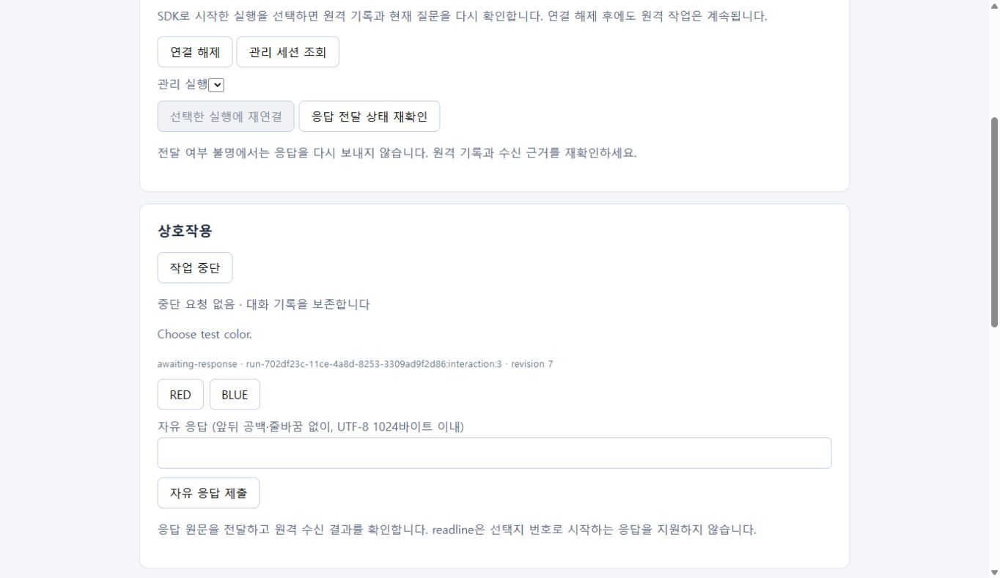

# 기록 동기화와 마지막 정상 대화

티켓 #10은 기록 읽기의 일시 오류를 빈 대화나 정상 완료로 해석하지 않는다. `Snapshot.historySync.current`가 `false`면 마지막 정상 메시지와 질문 내용·ID를 유지하고 `historySync.warning`으로 동기화 문제를 알린다. 공개 `respond()`는 `history-unconfirmed`로 거부하며 입력을 보내지 않는다. 중단은 별도의 소유 프로세스 확인에 따르므로 동기화 문제만으로 중단 버튼을 막지 않는다.

```js
const snapshot = await client.refresh();
if (!snapshot.historySync.current) {
  showWarning(snapshot.historySync.warning);
  disableAnswers();
}
// 읽기만 다시 수행한다. 응답·CLI 실행을 재시도하지 않는다.
const checked = await client.refresh();
```

원격 helper는 CLI 파일을 읽기 전용으로 연다. 같은 fd의 읽기 전후 inode·size·mtime·ctime과 현재 경로의 버전을 대조하여 읽는 동안 파일이 교체되거나 수정되면 `file-changed`로 반환한다. 전체 payload 상한은 16 MiB다. 파일 읽기 실패·누락도 명시적인 `historyError`이며, 다른 PTY·프로세스 관측을 버리는 전체 RPC 오류로 바꾸지 않는다. 부분 JSON이나 잘못된 세션 envelope는 SDK가 거부한다. 응답 직전 원격 hash 확인에도 같은 일관된 읽기를 사용한다.

공유 reducer는 순서가 있는 원문 `history-failure` 관측과 잘못된 `history`를 처리한다. 읽기 오류 동안 현재성은 거짓이며 메시지·tool 상태와 질문 ID는 마지막 정상 값이다. 신뢰할 수 없는 완료 hint만으로 대화를 `completed`로 만들지 않는다. 이후 정상 전체 `history`가 오면 경고를 해제한다. 마지막 정상 hash와 같아도 재확인이 필요하면 전체 기록을 다시 처리한다. 알림이 없어도 `refresh()`는 전체 기록을 조회하므로 메시지 수정에 수렴한다. 같은 메시지 ID는 수정되고 동일 snapshot은 이벤트를 중복 발생시키지 않는다. 새 tool·현재 화면은 새 질문으로 구분한다.

`nextObservation()`로 잘못된 JSON을 재생하면 기존 API의 `invalid-history` 오류를 유지하며, 오류 후 snapshot에는 경고와 마지막 정상 대화가 남는다. 다음 관측으로 계속 재생할 수 있다. 명시적인 `history-failure`는 읽기 실패 관측이므로 예외 없이 경고를 만든다. 기대 normalized 이벤트는 decoder 입력이 아니다.

## 검증과 자료 출처

```powershell
npm test
node --test tests/history-sync.test.mjs
```

세 공개 SDK 테스트는 외부 OpenSSH 프로세스 또는 파일 입력 경계에서 부분 JSON·읽기 실패·파일 교체·누락을 주입한다. 이후 정상 전체 조회로 같은 질문 ID와 마지막 메시지의 수정을 확인하고, 중복 snapshot 및 새 질문을 구분한다. CLI 저장 파일을 수정하지 않는다.

`fixtures/history-sync/recovery.json`의 최초 terminal/tool 자료는 검토된 공개 Cline 3.0.69의 `fixtures/interactions/choice.json`에서 가져왔다. provenance에는 원본 SHA-256과 각 변환을 기록한다. 보존할 텍스트 메시지, `history-failure`, 수정·중복 snapshot, 새 tool·PTY 질문은 명시적인 합성 자료다. 실제 운영 중 자연 발생한 부분 쓰기나 파일 교체를 관측했다는 주장은 하지 않는다. 회사 환경은 미검증이다.

브라우저 검증은 실제 Windows Chrome에서 예제와 공개 live SDK를 사용하며, 외부 OpenSSH 경계를 검토된 fault 자료로 대체한다. 테스트 전용 source는 원문 관측·파일 오류만 공급하고 응답 입력은 거부한다. 실제 SSH 서버·원격 CLI 장애 재현과 구분하며 모델 실행·인증 사본이 필요 없다. 정상 → 오류 → 정상 source 전환 후 예제의 원격 기록 갱신을 호출하여 메시지·질문 유지, 경고, 응답 차단, 같은 ID 복구를 확인한다.

재현용 source는 `tests/support/history-browser.mjs`다. 예제의 SDK 경로를 바꾸지 않고 외부 OpenSSH 프로세스만 대체한다. 다음 명령으로 시작하고, UI에서 host `fixture`, CLI `/fixture/cline`, 관리 경로 `/fixture/control`, cwd `/fixture/work`, terminal mode `readline`을 선택하여 연결·시작한다.

```powershell
$historyStage = Join-Path $env:TEMP 'cline-sdk-history-stage.txt'
Set-Content -LiteralPath $historyStage -Value good -NoNewline
node tests/support/history-browser.mjs $historyStage
# 별도 터미널에서 stage를 바꾸고 UI의 원격 기록 갱신을 호출한다.
Set-Content -LiteralPath $historyStage -Value partial -NoNewline
Set-Content -LiteralPath $historyStage -Value updated -NoNewline
```

source는 `good`, `partial`, `read-failed`, `file-changed`, `missing`, `updated`를 지원한다. `updated`는 같은 ID의 메시지를 수정한다. 테스트 source의 process/PID는 합성 표식이므로 실제 원격 프로세스 생존 증거로 사용하지 않는다. source는 SDK 입력 요청을 기록·거부하며 CLI 입력을 보내지 않는다.

현재 helper의 실제 Windows Node → WSL SSH 정상 읽기도 별도로 수행했다. 앞서 완료된 테스트 소유 실행 `run-b04fc08c-870c-4766-ad30-ef1a7d128843`에 읽기 전용 `attach()`를 호출하여 세션 `1791547004425_c0xok`, `historySync.current=true`, 경고 없음과 `SDK_UNCERTAIN:BLUE`를 포함한 메시지 2개를 확인했다. 새 모델 실행이나 CLI 입력·인증 사본 준비 없이 기존 원격 기록만 읽었다. 이 결과는 실제 정상 조회 근거이며 장애 주입 근거가 아니다.

Windows Chrome의 장애 주입 검증은 실행 `run-702df23c-11ce-4a8d-8253-3309ad9f2d86`, 세션 `session-7f73bef4a3f1`에서 수행했다. 정상 source에서 `Choose test color.` 질문과 `Last good conversation retained`를 확인한 후 부분 JSON source로 전환하고 원격 기록 갱신을 호출했다. 같은 interaction 3과 마지막 정상 메시지를 유지하면서 revision 8의 `unknown`, 한국어 경고, 선택·자유 입력 차단을 확인했다.




정상 `updated` source로 되돌린 뒤 명시적으로 갱신했을 때 `current=true`와 경고 해제, 같은 interaction 3·질문 revision 7의 유지, 같은 메시지 ID의 `Full requery updated the same message` 수정, 전역 revision 11의 `awaiting-input`, 선택·자유 입력 활성화를 확인했다. 브라우저 검증에서는 응답을 제출하지 않았다. 검증용 로컬 서버는 종료했으며 원격 인증·keepalive·CLI 실행을 새로 만들지 않았다.


