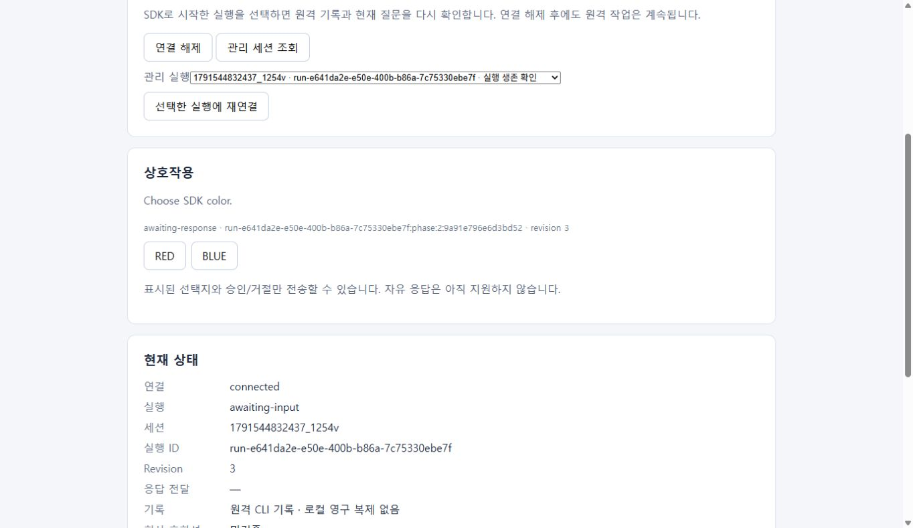
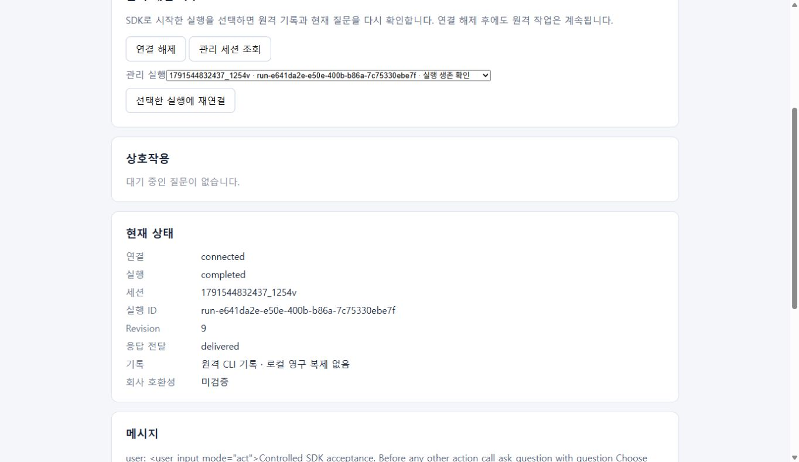

# 관리 실행 재연결과 앱 재시작

티켓 #6은 연결 해제와 원격 작업 수명을 분리한다. `disconnect()`는 로컬 SSH만 닫고 클라이언트를 재사용할 수 있게 한다. `close()`는 해당 클라이언트를 최종 정리하며, 새 SDK 프로세스는 같은 SSH 설정과 `remoteRoot`로 SDK 관리 실행을 다시 찾는다. 두 호출 모두 원격 CLI를 중단하지 않는다.

```js
const client = createClient({ mode: "live", connection });
await client.connect();
const runs = await client.listManagedExecutions();
const selected = runs.find(
  (run) => run.executionId === lastSelectedExecutionId,
);
if (!selected) throw new Error("관리 실행을 찾을 수 없습니다.");
const restored = await client.attach(selected.executionId);
console.log(
  restored.sessionId,
  restored.executionId,
  restored.messages,
  restored.interaction,
);
client.disconnect();
await client.connect();
await client.attach(selected.executionId);
```

하나의 클라이언트는 하나의 실행을 선택한다. 다른 실행을 선택하려면 새 클라이언트를 만든다. `attach()`는 살아 있는 실행에 재연결하거나 종료된 실행의 기록과 종료 근거를 읽는다. CLI를 새로 실행하지 않으며 같은 대화를 새 실행으로 재개하는 동작은 후속 API가 담당한다. 미지원 CLI profile 또는 이전 실행과 다른 fingerprint에서는 조작을 허용하지 않는다.

목록은 소유자 전용 SDK 관리 디렉터리 안의 `owner: cline-cli-sdk` 실행 메타데이터만 조회한다. 임의 tmux/터미널 실행을 인계받지 않는다. `/proc` PID·startTime·Linux boot ID를 모두 대조해 생존을 확인하며, 종료 witness 없이 남은 manifest나 과거 PID는 실행 중 또는 성공으로 표시하지 않는다.

재연결은 전체 CLI messages 파일, 실제 프로세스, 현재 tmux 화면을 대조한다. 화면은 ANSI style을 포함한 현재 40×120 pane과 실제 cursor 좌표를 받아 xterm 경로로 다시 해석한다. 화면 복원에 실패하고 유한한 PTY ring에서 누락이 발생했으면 입력을 차단한다. 이전 raw 출력만 다시 적용해 질문을 추정하지 않는다. 정상 poll에서 변하지 않은 질문과 메시지는 새 이벤트로 만들지 않는다.

질문의 ID는 별도 SDK `phase.json`에 epoch와 tool·단계·질문 fingerprint로 보존한다. 같은 대기 질문은 앱 재시작 뒤 같은 ID를 갖고, 닫힌 뒤 동일 문구가 다시 나타나는 단계는 새 epoch를 갖는다. 제어 메타데이터에는 답변 원문 대신 digest와 요청 식별정보를 남긴다. CLI 세션 파일을 수정하지 않는다. 제출 후 수신 불명이 된 요청의 정책과 재대조는 #7의 범위이며 재연결 자체가 자동 재제출을 수행하지 않는다.

예제는 브라우저 저장소에 호스트·CLI/관리/작업/데이터 경로와 마지막 선택 실행 ID만 저장한다. 요청·대화·PTY·비밀키 내용·인증 파일은 저장하지 않는다. 로컬 Node 서버를 재시작한 뒤 연결·환경 점검 → 관리 실행 선택 → 재연결로 원격 기록을 읽는다. SSH 키 파일 경로는 브라우저 저장소에 보존하지 않는다.

## Windows → WSL 수용 기록

고정 공개 Cline 3.0.69와 Linux x64 SHA-256 `8ddf33048e9e4418d89aabe2792ceac83d3905b83b18ae21fed2f4f890c37032`로 실측했다. 회사 CLI는 미검증이다. Windows SDK는 기존 `wsl` OpenSSH alias와 ProxyCommand를 사용했다. 전용 keepalive로 원격 Linux를 유지했으며 사용자 배포판을 종료하지 않았다. 인증은 테스트 전용 데이터 디렉터리에 원격에서 원격으로 복사하고 원문을 Windows로 읽지 않았다.

- 실행 `run-bc8d3cf0-51f6-4e45-880f-3dc4e33fafa4`, 세션 `1791544733174_slwvr`: 도구 승인 뒤 선택 질문의 phase 2 ID를 확인했다. SDK `disconnect()` → `connect()` → `attach()`에서 같은 실행·질문을 복구했다. 최초 Windows Node 프로세스를 종료한 뒤 별도 Node 프로세스가 목록에서 같은 실행을 찾아 같은 ID로 복원했고, `BLUE`의 같은 tool result 전달과 `SDK_RECONNECTED:BLUE` 및 정상 종료를 확인했다.
- 실행 `run-e641da2e-e50e-400b-b86a-7c75330ebe7f`, 세션 `1791544832437_1254v`: 공개 `refresh()`가 실제 Windows OpenSSH를 실행한 직후 해당 테스트 소유 SSH PID 7556을 종료했다. SDK는 `ssh-failed`와 `disconnected`를 반환했다. 새 클라이언트에서 실제 remote PID/startTime/boot 생존과 동일 phase 2 ID `9a91e796e6d3bd52`를 확인했다.
- 같은 두 번째 실행을 Windows Chrome 예제에서 목록 → 선택 → 재연결로 복구했다. 원격 질문을 유지한 채 로컬 Node 서버를 종료하고 새 Node PID 29124로 재시작했다. 브라우저 새로고침 뒤 저장된 연결 경로와 마지막 실행 ID를 복구하고 같은 session·execution·phase 2 질문에 재연결했다. `BLUE`의 전달과 `SDK_RECONNECTED:BLUE`, `completed`를 확인했다. 백그라운드 poll은 응답 버튼을 비활성화하지 않고, 실제 제출·불명·미지원 상태에서만 해당 조작을 차단한다.
- 자연 종료한 첫 실행은 실제 CLI 부재와 supervisor exit·completed manifest·assistant history를 대조해 `completed`로 복원했다. 별도 소유 메타데이터 fault로 이전 boot ID를 주입한 실행은 history를 읽되 `unknown`, Linux PID 1에 잘못된 startTime을 붙인 실행은 `unknown`과 빈 interaction을 유지했다. SDK owner marker가 없는 실행은 목록에 나타나지 않았다. 이는 제어 메타데이터 주입이며 실제 Linux 종료·재부팅 시험이 아니다. Linux PID 1에는 입력·signal을 보내지 않았다.




자동 회귀는 `npm test`로 실행한다. 공개 SDK seam에서 새 소비 앱의 목록·전체 기록·화면 복원, stage ID 보존/새 epoch, 단절과 늦은 poll의 경쟁을 검증한다. 머신 boot 변경과 과거 PID는 fault injection으로 표시하며 실제 머신 종료의 실측과 혼동하지 않는다. WSL 자체 종료·재부팅 후 프로세스 생존을 보장하지 않는다.

실제 복구 예제는 `CLINE_SDK_HOST`, `CLINE_SDK_CLI`, `CLINE_SDK_REMOTE_ROOT`, 선택적으로 `CLINE_SDK_EXECUTION_ID`를 설정하고 `node examples/node/reconnect.mjs`로 실행한다. 이 명령은 목록과 현재 상태를 읽고 입력·모델 호출·작업 시작을 수행하지 않는다. WSL keepalive와 격리 인증 사본은 각 테스트의 소유물을 확인하고 제거했으며 사용자 원본 인증과 다른 실행은 유지했다.
