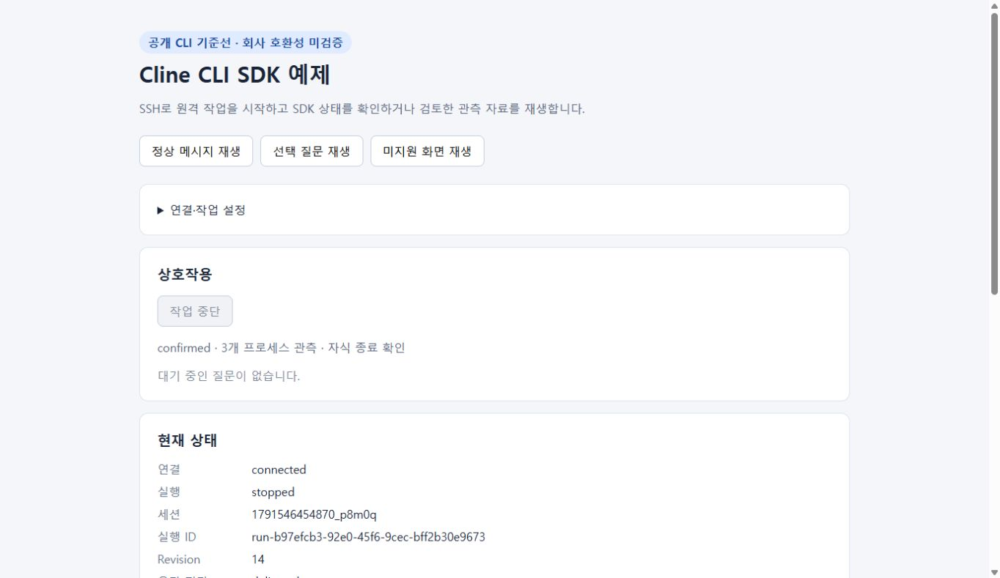
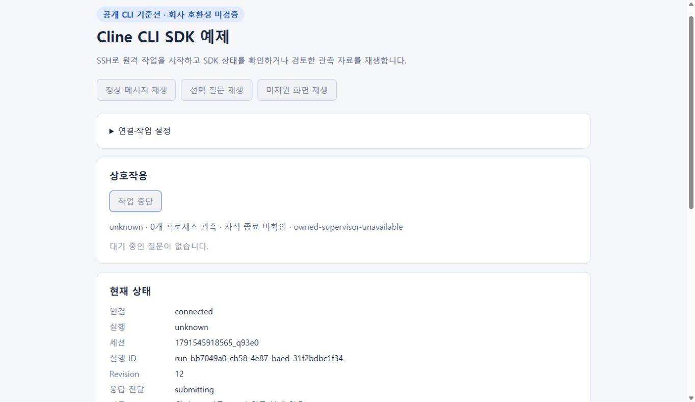

# 현재 관리 작업 중단

`client.stop({executionId, requestId})`는 현재 클라이언트가 선택한 SDK 관리 실행만 중단한다. 연결 해제와 별도 동작이며 CLI 세션 파일을 수정하거나 삭제하지 않는다. 같은 요청 ID는 같은 결과를 반환하고, 다른 실행 또는 이미 선택한 중단 요청과 다른 ID는 입력 전에 거부한다. 정상 완료된 실행에 새 중단 요청을 보내도 새 실행을 만들지 않는다.

```js
const current = client.snapshot();
const receipt = await client.stop({
  executionId: current.executionId,
  requestId: crypto.randomUUID(),
});
console.log(receipt.state, client.snapshot().execution);
```

중단 요청이 예약되면 응답 입력을 차단한다. `snapshot.stop`은 `stopping`, `confirmed`, `unknown`을 구분한다. `confirmed`와 `execution: stopped`에는 동일 boot ID/PID/starttime으로 식별한 CLI 및 자식의 종료 확인이 필요하다. CLI exit code, cancelled manifest, 거절 뒤 Stop this run 문구만으로 종료 확인을 대체하지 않는다. 잔존 프로세스, 소유권·관측 한도 오류, SSH 또는 확인 시간 초과는 `unknown`을 유지한다. 연결을 잃어도 자동 재전송하지 않는다. 이후 현재 상태 조회/재연결로 원격에 남은 완료 근거를 확인한다.

`snapshot.executionEvidence`는 현재 프로세스 관측과 자식 identity 목록을 제공한다. `stop.targets`, `remaining`, `trackedCount`, `childrenVerified`, `reason`, `observedAt`은 중단 대상과 확인 범위를 설명한다. 로컬의 PID 숫자를 원격 제어 명령으로 전달할 필요가 없다. 재생 모드의 `stop`은 `replay-read-only` 오류를 반환하며 SSH나 CLI 입력을 실행하지 않는다.

## 원격 권한과 한도

Linux Python 3.9 이상, pidfd 지원 커널/Python, `prctl` child-subreaper, 기존 tmux 및 PTY가 필요하다. 환경 점검은 pidfd가 없으면 `pidfd-unavailable`을 보고한다. 실제 supervisor는 subreaper/pidfd를 확인한 후 CLI를 시작한다. 인증 파일이나 전역 설정을 읽거나 변경하지 않는다.

SDK가 시작한 supervisor의 후손을 실행 중 계속 관측한다. 고아가 된 명령은 같은 supervisor가 인계받아 종료 근거를 유지한다. 한 실행의 살아 있는 소유 프로세스 한도는 4,096개이며, 초과 시 살아 있는 대상을 버리거나 성공으로 표시하지 않는다. 메타데이터는 CLI 데이터 디렉터리 밖의 SDK 관리 디렉터리에 남는다.

중단은 정확히 식별한 프로세스를 먼저 정지해 새 자식 생성과 경쟁을 줄이고, TERM/CONT 후 2초를 기다린다. 잔존 대상은 3초 범위에서 KILL하고 전체 목록이 사라졌는지 확인한다. 정지한 대상이 실패 후에도 살아 있으면 `finally`에서 같은 identity만 CONT한다. 각 signal은 pidfd로 실제 OS 프로세스에 연결하므로 PID 재사용 사이에 다른 작업을 제어하지 않는다. 프로세스 그룹 전체, `pkill`, `tmux kill-server`는 사용하지 않는다. 원격 중단 확인은 최대 8초이며 SSH 호출의 별도 제한 안에서 실행된다.

## #8 검증

- `npm test`: 소비 SDK 공개 API에서 동일 요청, 잘못된 실행, 종료 미확인, 잔존 자식 cancelled manifest, 읽기 전용 재생을 검사한다. OpenSSH 경계만 대체한 사례는 실제 원격 측정과 구분한다.
- `fixtures/stop/owned-child-stop.json`: 공개 CLI 3.0.69에서 측정한 raw process 관측 두 개를 선택했다. CLI+Python+sleep 세 identity의 중단 완료를 동일 reducer로 재생한다. PTY와 대화는 생략했으므로 선택·잘림 기록이다.
- Windows Node→WSL 공개 API 실측: `python3 -u child.py`의 Python과 그 자식 `sleep 180`이 살아 있음을 먼저 관측했다. 명시적 `stop` 후 세 대상이 사라졌고 같은 세션·기존 대화를 보존했으며 동일 요청 결과가 유지됐다. 별도 브라우저 실측은 아래 증거를 따른다.

Windows Chrome에서도 실행 `run-b97efcb3-92e0-45f6-9cec-bff2b30e9673`, 세션 `1791546454870_p8m0q`의 살아 있는 Python·sleep을 확인한 뒤 승인 제출 중 작업 중단 버튼을 눌렀다. 2026-10-09 11:48:03 UTC에 CLI PID 113617, Python 114422, sleep 114423 세 identity가 모두 종료됐고 `confirmed`, 자식 종료 확인, `stopped` 및 보존된 대화를 표시했다. Stop 버튼은 완료 후 비활성화됐다. SDK supervisor의 후손이 아닌 시험 소유 sentinel PID 71638은 그 뒤에도 살아 있었으며, 별도 진단 정리로 해당 sentinel만 종료했다. 인증 사본과 시험 소유 WSL keepalive를 정리하고 세션·실패 기록은 보존했다.



최초 브라우저 실행에서는 `/proc` 전체 조회와 thread children 조회 사이의 자식 생성/스레드 종료를 관측 불가로 오인했다. SDK는 `owned-supervisor-unavailable`, `unknown`을 표시했으며 자동 중단 재시도나 거짓 성공은 없었다. 사라진 thread만 확인 후 제외하고 조회 뒤 새로 태어난 읽기 가능한 자식은 즉시 추적하도록 수정했다. 실패 기록을 보존하고 새 Node API 실행과 새 브라우저 실행에서 다시 세 프로세스 종료를 확인했다. Cline 자체 `run_commands`의 기본 제한은 30초이므로 그 제한에 먼저 걸려 종료된 별도 시도는 SDK 중단 수용으로 세지 않았다.



#5 TUI 및 #6 재연결 통합 뒤에도 공개 API를 다시 실측했다. 실행 `run-f430cd99-60a9-44a1-b62a-24e67f298031`, 세션 `1791546767238_4xkph`의 CLI 119121, Python 119668, sleep 119669를 중단하고 세 identity의 종료를 확인했다. 새 SDK 클라이언트의 `listManagedExecutions()`와 `attach(executionId)`에서도 동일 중단 요청 ID, `confirmed`/`stopped`, 동일 세션과 두 대화 메시지를 복원했다. 이 재접속은 새 CLI나 모델 실행을 만들지 않았다.

마지막 PID 재사용 안전 검토에서 새 자식의 실제 PPID와 부모 identity를 재확인하도록 강화했다. 그 뒤 실행 `run-24a0aa3a-6b13-4c9b-9ba4-c9294857ed1d`, 세션 `1791546996636_fhh0g`을 다시 실측해 CLI 122468/Python 123381/sleep 123382의 종료와 대화 보존을 확인했다. 누적 관측은 네 프로세스였고 중단 시 살아 있던 대상 세 개가 모두 사라졌다. 해당 인증 사본과 시험 keepalive도 정리했다.

재현용 격리 work 디렉터리에서 `child.py`를 준비한다. 이는 시험 명령 파일이며 제품 SDK가 CLI 기록을 고치는 기능이 아니다.

```python
import os, subprocess, time
p = subprocess.Popen(['sleep', '180'])
print('SDK_CHILD_READY', os.getpid(), p.pid, flush=True)
time.sleep(180)
```

고정 CLI 경로와 별도 `dataDir` 인증을 준비한 뒤 `start` 요청에서 `run_commands`로 `python3 -u child.py` 한 번을 요구한다. 승인 화면을 공개 `respond` API로 승인하고 `executionEvidence.children`이 나타난 후 `stop`을 호출한다. 셸 인라인 Python 문자열처럼 긴 approval JSON은 현재 120-column readline에서 줄바꿈되어 미지원으로 남을 수 있다. 최초 측정에서 이 사례에는 응답하지 않았고 해당 실행만 진단 정리했으며, 짧은 시험 명령으로 다시 측정했다. 일반 입력 우회로 이 제한을 숨기지 않는다.

공개 기준선과 fixture/브라우저 검증은 회사 CLI의 중단 호환성 증거가 아니다. 회사 프로필은 미검증을 유지한다.
